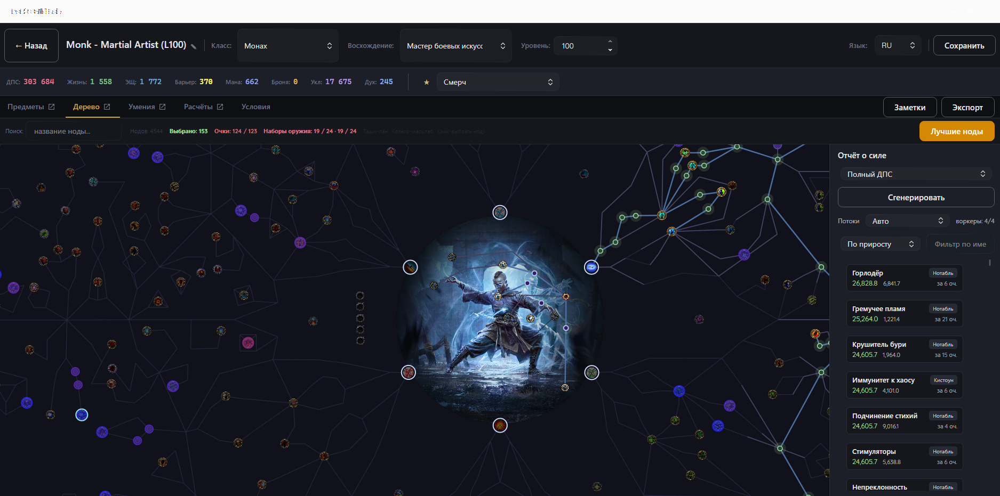
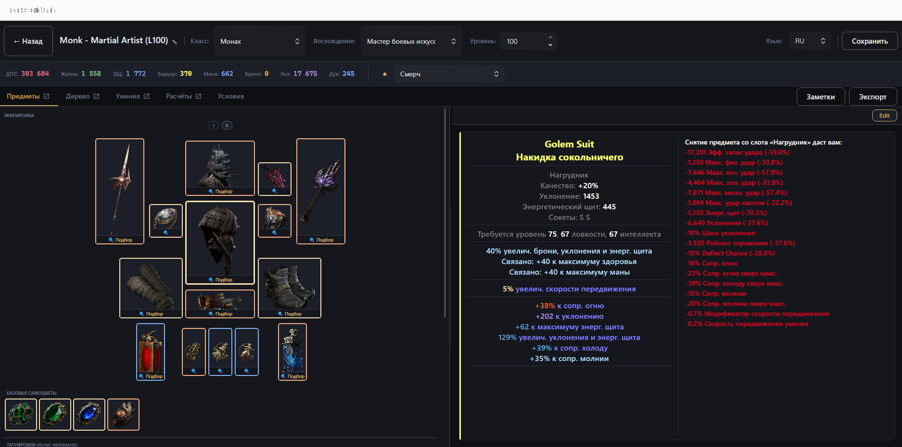
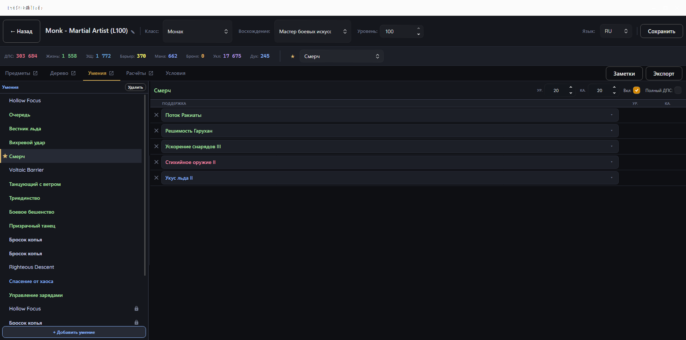
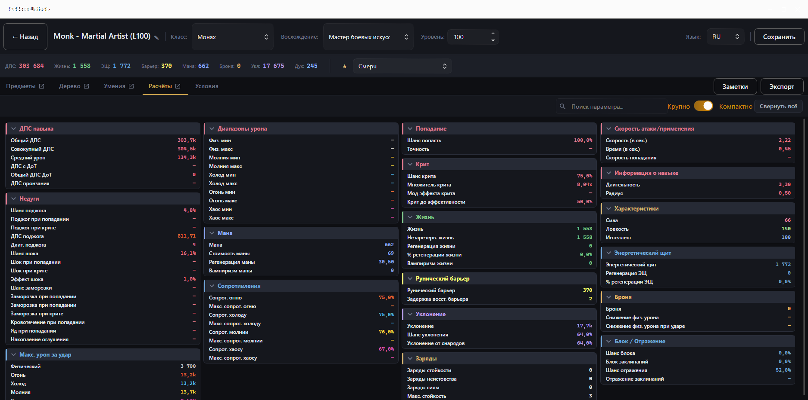

# PoE2 Build Lab

**Планировщик билдов для Path of Exile 2 — на русском языке, с нативным интерфейсом.**

Форк [Path of Building Community (PoE2)](https://github.com/PathOfBuildingCommunity/PathOfBuilding-PoE2)
с полностью переписанным интерфейсом на .NET 9 / Avalonia и сквозной русской
локализацией. Движок расчётов — оригинальный, проверенный PoB.

[English version](README.en.md) · [Telegram](https://t.me/PoE2BuildLab) · [Boosty](https://boosty.to/poe2buildlab)

<!-- SCREENSHOTS: заполняется после задачи #37 (иконки предметов). Файлы — docs/assets/screenshots/ -->

  
  

  
  

## Скачать

Готовые сборки — на странице [Releases](https://github.com/Visp1024/Poe2-Build-lab/releases).

- Windows 10/11, x64;
- устанавливать ничего не нужно: архив распаковывается в любую папку и запускается;
- .NET на компьютере **не требуется** — он уже внутри сборки.

## Чем отличается от оригинального Path of Building

| | Оригинальный PoB2 | PoE2 Build Lab |
|---|---|---|
| Интерфейс | Lua + собственный рендерер SimpleGraphic (DirectX) | нативный .NET 9 / Avalonia |
| Язык | только английский | **русский** (интерфейс, гемы, статы, ноды дерева, моды предметов) |
| Движок расчётов | Lua 5.1 / LuaJIT | тот же код на Lua 5.4 через NLua |
| Окна | одно окно, вкладки внутри | вкладки отрываются в отдельные окна, заметки и настройки — свои окна |

Расчёты — это буквально тот же самый Lua-код, что и в апстриме: он не
переписывался, а был перенесён на Lua 5.4 и покрыт автоматической проверкой
паритета — каждый билд прогоняется через оба движка и все статы сравниваются
до шестого знака.

## Возможности

**Дерево пассивных умений**
- полное дерево PoE2 с классами и восхождениями, поиск по узлам;
- **тепловая карта мощности узлов** — показывает, какой ещё не взятый узел
  даёт больше всего выбранного стата (DPS, EHP и т. д.) на вложенное очко,
  с учётом того, сколько очков до него нужно потратить;
- расчёт идёт в пуле фоновых воркеров, интерфейс не замирает.

**Предметы**
- фигура персонажа со всеми слотами, пул предметов, базы и уникальные;
- тултипы в стиле игры — с русским переводом каждой строки модов;
- редактор предметов: база, редкость, аффиксы с ползунками роллов, качество,
  руны, порча;
- при наведении показывается разница статов с уже надетым предметом;
- **подбор апгрейдов через официальный трейд** — под каждым слотом кнопка
  «Подбор», окно ищет предметы на pathofexile.com/trade2 по выбранным весам
  статов (вход по официальному OAuth GGG).

**Умения**
- группы умений, активные и поддерживающие гемы, уровни и качество;
- переведённые описания гемов и теги;
- моды с сокетов и гемы, выдаваемые предметами, применяются автоматически.

**Расчёты**
- полная разбивка урона и защит из PoB — как именно получилась каждая цифра;
- сводка ключевых статов в шапке билда.

**Прочее**
- импорт персонажа с pathofexile.com, импорт и экспорт кодов билдов;
- заметки к билду в отдельном окне;
- конфигурация боя (ауры, баффы, заряды, проклятия, сопротивления врага…);
- размеры и положение окон запоминаются между запусками.

## Сообщество и поддержка

- **Telegram** — [@PoE2BuildLab](https://t.me/PoE2BuildLab): анонсы версий,
  вопросы, баг-репорты, обсуждение.
- **Boosty** — [boosty.to/poe2buildlab](https://boosty.to/poe2buildlab):
  поддержать разработку.

Баги и предложения также можно оставлять в
[Issues](https://github.com/Visp1024/Poe2-Build-lab/issues).

## Благодарности

Проект существует благодаря
[Path of Building Community](https://github.com/PathOfBuildingCommunity) и
изначальному Path of Building Openarl'а — весь движок расчётов, база данных
модов и логика билдов пришли оттуда. Апстрим регулярно вливается обратно в этот
форк.

Path of Exile 2 — торговая марка Grinding Gear Games. Проект не связан с GGG и
не поддерживается ими.

## Лицензия

[MIT](LICENSE) — как и у оригинального Path of Building.

Лицензии сторонних компонентов (Lua PUC-Rio, зависимости движка и данные)
собраны в [LICENSE.md](LICENSE.md). Лицензионная информация считается частью
документации.

## Разработка

Инструкции по сборке, тестам и вкладу в код — в
[CONTRIBUTING.md](CONTRIBUTING.md); архитектура C#-части описана в
[AVALONIA_MIGRATION_PLAN.md](AVALONIA_MIGRATION_PLAN.md), процесс релиза — в
[RELEASE_PBLApp.md](RELEASE_PBLApp.md).
